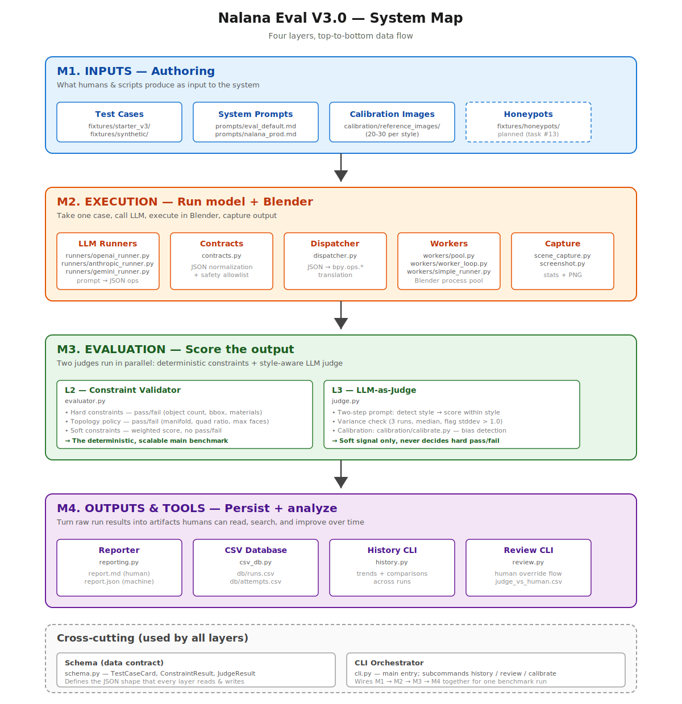

# Nalana Eval V3.0 — System Map

> A modular knowledge base of how the system is organized. If you're new to the codebase or need to hand it off, start here.

**中文版**: [`SYSTEM_MAP.zh.md`](SYSTEM_MAP.zh.md)

---

## At a glance



The system is **four layers** that data flows through top-to-bottom, plus **two cross-cutting concerns** (Schema and CLI) used by every layer.

| Layer | Question it answers | Lives in |
|---|---|---|
| **M1. Inputs** | What does the system consume? | `fixtures/`, `prompts/`, `calibration/` |
| **M2. Execution** | How do we get a 3D output? | `nalana_eval/runners/`, `dispatcher.py`, `workers/`, `screenshot.py`, `scene_capture.py`, `contracts.py` |
| **M3. Evaluation** | How do we score the output? | `evaluator.py`, `judge.py`, `calibration/calibrate.py` |
| **M4. Outputs & Tools** | How do humans see and improve it? | `reporting.py`, `csv_db.py`, `history.py`, `review.py` |
| Cross-cutting | The data contract + the orchestrator | `schema.py`, `cli.py` |

---

## M1. Inputs (Authoring)

**One-line summary**: everything humans or scripts produce that the system reads as input.

### Components

| Component | Files | Purpose |
|---|---|---|
| **Test cases** | `fixtures/starter_v3/*.json`, `fixtures/synthetic/generate_cases.py` | The benchmark itself. Each case is a `TestCaseCard` (prompt + initial scene + constraints + style intent). 30 hand-authored starter cases + 50 programmatically generated. |
| **System prompts** | `prompts/eval_default.md`, `prompts/nalana_prod.md`, `prompts/judge_prompt.md` | The prompt the LLM sees. `eval_default` is neutral (for fair model comparison); `nalana_prod` mirrors production; `judge_prompt` is the two-step detect-then-score template. |
| **Calibration images** | `calibration/reference_images/` *(gitignored)* | 20–30 reference images per style (cartoon / realistic / low-poly / stylized) used to detect judge bias. Currently empty — needs art assets. |
| **Honeypots** *(planned)* | `fixtures/honeypots/` | Deliberately-failing cases mixed into a run to detect judge malfunction. Not implemented yet — tracked under task #13. |

### What feeds in

- A human writing a new case → `fixtures/starter_v3/<category>.json` (see `TEST_CASE_AUTHORING.md` for the spec)
- The synthetic generator → `fixtures/synthetic/generated_primitive_cases.json` (50 cases from primitive × color × size combinatorics)
- Future LLM-assisted authoring → `fixtures/llm_authored_v3/` (task #13)

### Output to next layer

A `TestCaseCard` JSON object handed to M2.

### Related tasks

- **#6** (done) — handcrafted starter cases
- **#8** (done) — synthetic generator
- **#12** (pending) — collect calibration reference images
- **#13** (pending) — LLM-assisted authoring + honeypots

---

## M2. Execution

**One-line summary**: take one `TestCaseCard`, call the LLM, execute the result in Blender, and produce screenshots + scene statistics.

### Components

| Component | Files | Purpose |
|---|---|---|
| **LLM Runners** | `nalana_eval/runners/openai_runner.py`, `anthropic_runner.py`, `gemini_runner.py`, `mock_runner.py` | Per-provider adapters. Each takes (system_prompt, case_prompt) and returns JSON ops. `mock_runner` is for tests. |
| **Contracts** | `nalana_eval/contracts.py` | JSON normalization + safety allowlist. Rejects dangerous ops (file delete, subprocess spawn, eval/exec) before they reach Blender. Three formats supported: `LEGACY_OPS`, `TYPED_COMMANDS`, `NORMALIZED`. |
| **Dispatcher** | `nalana_eval/dispatcher.py` | Translates the JSON op list into actual `bpy.ops.*` calls inside Blender. |
| **Workers** | `nalana_eval/workers/pool.py`, `worker_loop.py`, `simple_runner.py` | Two execution modes. Pool (default) keeps N long-lived `blender --background` processes; simple-mode spawns a fresh Blender per case (slower but bulletproof). |
| **Capture** | `nalana_eval/scene_capture.py`, `nalana_eval/screenshot.py` | After ops execute, capture the scene. `scene_capture` extracts geometry stats (object list, bbox, vertex/face counts, materials) into JSON. `screenshot` renders an 800×600 PNG via Workbench engine + procedural isometric camera. |

### Flow within M2

```
TestCaseCard
   ↓
LLM Runner — prompt → JSON ops (raw, untrusted)
   ↓
Contracts — normalize + safety check
   ↓
Worker (pool or simple) — feed JSON ops to a Blender process
   ↓
Inside Blender:
   reset_scene → Dispatcher executes ops → Capture stats → Screenshot
   ↓
Return: {scene_stats.json, screenshot.png, error?}
```

### Output to next layer

For each attempt: a screenshot (PNG), a scene-stats JSON, and an execution status. Handed to M3.

### Related tasks

All shipped under #2 (full rewrite) and #7 (end-to-end dry-run).

---

## M3. Evaluation

**One-line summary**: take the scene-stats and screenshot from M2, decide pass/fail and assign scores.

### Sub-modules

#### L2 — Constraint Validator (deterministic)

**File**: `nalana_eval/evaluator.py`

This is the **main benchmark**. It reads the scene-stats JSON and the case's constraints, returns:

- **Hard constraints**: `mesh_object_count`, `required_object_types`, `bounding_boxes`, `materials` — each is pass/fail. Any failure → the case fails hard.
- **Topology policy**: `manifold_required`, `quad_ratio_min`, `max_vertex_count` — also pass/fail.
- **Soft constraints**: weighted continuous metrics like vertex count. Contributes to the soft score, never decides pass/fail.

Output: `ConstraintResult { hard_pass, topology_pass, soft_score, failure_class }`.

#### L3 — LLM-as-Judge (subjective signal)

**File**: `nalana_eval/judge.py`

Looks at the screenshot and gives soft scores for what constraints can't capture: "does it look like an apple", "is it well-proportioned". Crucial design choice: **scores by detected style, not by a fixed yardstick** — so a cartoon apple isn't penalized for not being photorealistic.

Mechanism (four steps from `DESIGN.md` §4.3):

1. Case author declares `style_intent` in the test case
2. Judge runs a two-step prompt: detect style → score within style
3. Calibration set verifies no systematic bias (see below)
4. Variance check: 3 runs, take median, flag if stddev > 1.0; honeypots detect judge malfunction

Judge scores **never decide hard pass/fail** — they are soft signals capped at ≤30% of total weight.

#### Calibration (sub-module of L3)

**Files**: `calibration/calibrate.py`, `calibration/README.md`, `calibration/reference_images/` *(gitignored)*

Tests the judge against known-good reference images (~20–30 per style). If the judge systematically scores cartoon lower than realistic at the same quality level, calibration drift > 0.3 → adjust the prompt or switch judge model.

Run with: `python -m nalana_eval.cli calibrate --judge-model gpt-4o`

### Output to next layer

For each attempt: `ConstraintResult` + `JudgeResult`. Handed to M4.

### Related tasks

- **#3** (done) — judge module with intent-aware scoring
- **#5** (done) — calibration tool + handbook
- **#12** (pending) — actually run the calibration baseline (needs reference images)

---

## M4. Outputs & Tools

**One-line summary**: persist results, generate human-readable reports, and provide CLIs to query history and inject human feedback.

### Components

| Component | Files | Purpose |
|---|---|---|
| **Reporter** | `nalana_eval/reporting.py` | Writes `report.md` (human-readable, with embedded screenshots and a `HUMAN_REVIEW_BLOCK` per case) and `report.json` (full structured data). Lives in `artifacts/run_<timestamp>/`. |
| **CSV Database** | `nalana_eval/csv_db.py` | Append-only persistence in `db/runs.csv` (one row per run) and `db/attempts.csv` (one row per attempt per case). Schema documented in `CSV_SCHEMA.md`. |
| **History CLI** | `nalana_eval/history.py` | `nalana-eval-history` — query trends across runs, head-to-head model comparisons, ASCII charts, optional matplotlib PNG. |
| **Review CLI** | `nalana_eval/review.py` | `nalana-eval-review` — collects `HUMAN_REVIEW_BLOCK` overrides from edited `report.md` files and writes them back to `attempts.csv` + `judge_vs_human.csv`. The accumulating `judge_vs_human.csv` is the future signal for fine-tuning the judge. |

### What it produces

For each run:

```
artifacts/run_<timestamp>/
├── report.md         ← what humans read
├── report.json       ← machine-readable mirror
├── failures.jsonl    ← per-failure detailed log
├── screenshots/      ← PNG + thumbnail per attempt
├── scene_stats/      ← geometry JSON per attempt
├── config.json       ← all CLI args used
└── baseline_delta.json  ← vs previous run of same model

db/
├── runs.csv          ← appended one row
├── attempts.csv      ← appended N rows (one per attempt)
└── judge_vs_human.csv ← appended on review
```

### Related tasks

- **#4** (done) — CSV database + history CLI
- All other M4 components shipped under #2

---

## Cross-cutting

### Schema (the data contract)

**File**: `nalana_eval/schema.py`

Pydantic v2 models. Every layer reads or writes one of these:

- `TestCaseCard` — produced by M1, consumed by M2 and M3
- `ExecutionResult` — produced by M2, consumed by M3
- `ConstraintResult`, `JudgeResult` — produced by M3, consumed by M4
- `RunSummary` — produced by M4

A schema change ripples through every layer — that's why task #13's "add `tags` field" is gated on V3.0 PR merging.

Note: `legacy_schema.py` is the v2.0 model, kept only for L1 unit tests (`--legacy-suite`).

### CLI Orchestrator

**File**: `nalana_eval/cli.py`

Top-level command parser. Routes to:

- main benchmark (no subcommand)
- `history` — query the CSV database
- `review --collect` — flow human feedback back into the DB
- `calibrate` — run the judge calibration set

This is what wires M1 → M2 → M3 → M4 together for one benchmark run. Argparse + small dispatcher; the actual work happens in the layer modules.

---

## How to navigate the codebase as a new contributor

If you're trying to fix a specific kind of bug, here's where to look:

| Symptom | Most likely layer | Check first |
|---|---|---|
| "The model returned weird JSON" | M2 | `runners/<provider>_runner.py` + `contracts.py` |
| "Blender crashed / hung" | M2 | `workers/pool.py`, retry logic + worker restart |
| "A constraint isn't being checked properly" | M3 | `evaluator.py` |
| "The judge is giving weird scores" | M3 | `judge.py` + `prompts/judge_prompt.md`, then run `calibrate` |
| "report.md looks wrong" | M4 | `reporting.py` |
| "The trend chart shows weird numbers" | M4 | `history.py` + check raw `db/runs.csv` |
| "A new case format I added isn't recognized" | Cross-cutting | `schema.py` (Pydantic validators) |
| "CLI flag I added isn't routed" | Cross-cutting | `cli.py` |

---

## How to navigate by task

| You want to... | Go to |
|---|---|
| Author a new test case | M1 (Inputs) — see `TEST_CASE_AUTHORING.md` |
| Add a new LLM provider | M2 — add `runners/<new>_runner.py`, register in factory |
| Add a new constraint type | M3 + Cross-cutting — `evaluator.py` + `schema.py` |
| Improve judge fairness | M3 — `prompts/judge_prompt.md`, then re-run calibration |
| Add a new CLI subcommand | Cross-cutting — `cli.py` |
| Add a new run-folder artifact | M4 — `reporting.py` |
| Investigate a regression | M4 (analysis) — `history.py`, `failures.jsonl` |

---

## Status snapshot (as of 2026-04-27)

```
M1 Inputs:        ✅ shipped (starter + synthetic) | ⏳ honeypots (#13), calibration imgs (#12)
M2 Execution:     ✅ fully shipped
M3 Evaluation:    ✅ shipped (L2 + L3 + calibration tool) | ⏳ baseline run (#12)
M4 Outputs:       ✅ fully shipped
Cross-cutting:    ✅ shipped | ⏳ wizard CLI subcommand (#14, blocked on #13)
```

See `README.md` for the task list with current status.

---

**Next reading**: [`DESIGN.md`](DESIGN.md) for the *why* behind each layer's design choices.
