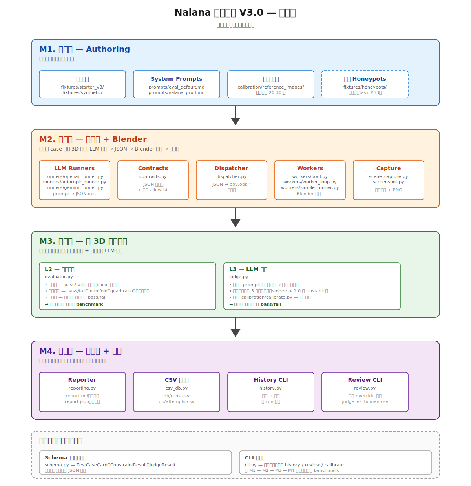

# Nalana 评测系统 V3.0 — 模块图

> 系统的模块化知识库。新人接手或者需要交接时，从这里开始读。

**English version**: [`SYSTEM_MAP.md`](SYSTEM_MAP.md)

---

## 一图概览



整个系统是**四层架构**，数据自上而下流过；外加**两条横切关注**（Schema + CLI），被所有层共用。

| 层 | 它回答什么 | 在哪里 |
|---|---|---|
| **M1. 输入层** | 系统吃什么进去？ | `fixtures/`, `prompts/`, `calibration/` |
| **M2. 执行层** | 怎么得到 3D 输出？ | `nalana_eval/runners/`, `dispatcher.py`, `workers/`, `screenshot.py`, `scene_capture.py`, `contracts.py` |
| **M3. 评分层** | 怎么给输出打分？ | `evaluator.py`, `judge.py`, `calibration/calibrate.py` |
| **M4. 产出层** | 人怎么看 + 怎么持续改进？ | `reporting.py`, `csv_db.py`, `history.py`, `review.py` |
| 横切 | 数据契约 + 总指挥 | `schema.py`, `cli.py` |

---

## M1. 输入层（Authoring）

**一句话总结**：所有人和脚本产出的、系统当输入读的东西。

### 组成

| 组件 | 文件 | 用途 |
|---|---|---|
| **测试用例** | `fixtures/starter_v3/*.json`, `fixtures/synthetic/generate_cases.py` | benchmark 本体。每条 case 是一个 `TestCaseCard`（prompt + 初始场景 + 约束 + 风格意图）。手写 30 条 starter + 程序化生成 50 条。 |
| **System prompts** | `prompts/eval_default.md`, `prompts/nalana_prod.md`, `prompts/judge_prompt.md` | LLM 看到的 prompt。`eval_default` 中性（公平比较模型用）；`nalana_prod` 复制生产 prompt；`judge_prompt` 是判官的两段式 detect-then-score 模板。 |
| **校准参考图** | `calibration/reference_images/` *(gitignored)* | 每种风格 20–30 张参考图（卡通 / 写实 / low-poly / stylized），用来检测判官偏差。当前空着——需要美术资源。 |
| **诱饵 Honeypots** *(规划中)* | `fixtures/honeypots/` | 故意失败的 case，混进 run 里检测判官失灵。还没实现——挂在 #13。 |

### 谁喂进来

- 手写新 case → `fixtures/starter_v3/<category>.json`（规范见 `TEST_CASE_AUTHORING.md`）
- 程序化生成器 → `fixtures/synthetic/generated_primitive_cases.json`（primitive × color × size 笛卡儿积，50 条）
- 未来 LLM 起草 → `fixtures/llm_authored_v3/`（task #13）

### 输出给下一层

一个 `TestCaseCard` JSON 对象，传给 M2。

### 相关 Tasks

- **#6**（已完成）— 手写 starter cases
- **#8**（已完成）— synthetic generator
- **#12**（待办）— 收集校准参考图
- **#13**（待办）— LLM 起草管线 + honeypots

---

## M2. 执行层

**一句话总结**：拿一个 `TestCaseCard`，调 LLM，让 Blender 执行结果，产出截图 + 场景统计。

### 组成

| 组件 | 文件 | 用途 |
|---|---|---|
| **LLM Runners** | `nalana_eval/runners/openai_runner.py`, `anthropic_runner.py`, `gemini_runner.py`, `mock_runner.py` | 各厂商 LLM 适配器。每个接收 (system_prompt, case_prompt) 返回 JSON ops。`mock_runner` 给测试用。 |
| **Contracts** | `nalana_eval/contracts.py` | JSON 规范化 + 安全 allowlist。在到达 Blender 之前拦掉危险 op（删文件、起子进程、eval/exec）。支持三种格式：`LEGACY_OPS`、`TYPED_COMMANDS`、`NORMALIZED`。 |
| **Dispatcher** | `nalana_eval/dispatcher.py` | 把 JSON op 列表翻译成 Blender 内的真实 `bpy.ops.*` 调用。 |
| **Workers** | `nalana_eval/workers/pool.py`, `worker_loop.py`, `simple_runner.py` | 两种执行模式。Pool（默认）维护 N 个常驻 `blender --background` 进程；simple-mode 每 case 重启一次 Blender（慢但稳）。 |
| **Capture** | `nalana_eval/scene_capture.py`, `nalana_eval/screenshot.py` | op 执行完后抓场景。`scene_capture` 提取几何统计（对象列表、bbox、顶点/面数、材质）写 JSON。`screenshot` 用 Workbench 引擎 + 程序化等距相机渲染 800×600 PNG。 |

### M2 内部流程

```
TestCaseCard
   ↓
LLM Runner — prompt → JSON ops（原始、不可信）
   ↓
Contracts — 规范化 + 安全检查
   ↓
Worker（pool 或 simple）— JSON ops 喂给 Blender 进程
   ↓
Blender 内：
   reset_scene → Dispatcher 执行 ops → Capture 抓统计 → Screenshot 渲染
   ↓
返回：{scene_stats.json, screenshot.png, error?}
```

### 输出给下一层

每个 attempt：截图（PNG）+ 场景统计 JSON + 执行状态。传给 M3。

### 相关 Tasks

全部在 #2（完整重写）和 #7（端到端 dry-run）里完成。

---

## M3. 评分层

**一句话总结**：拿 M2 出的场景统计 + 截图，决定 pass/fail 并打分。

### 子模块

#### L2 — 约束验证（客观）

**文件**：`nalana_eval/evaluator.py`

这是**主 benchmark**。读场景统计 JSON 和 case 的约束，输出：

- **硬约束**：`mesh_object_count`、`required_object_types`、`bounding_boxes`、`materials`——每条 pass/fail，任一不满足整 case 硬挂。
- **拓扑约束**：`manifold_required`、`quad_ratio_min`、`max_vertex_count`——也是 pass/fail。
- **软约束**：顶点数等连续指标，加权评分，**不决定 pass/fail**，只贡献分数。

输出：`ConstraintResult { hard_pass, topology_pass, soft_score, failure_class }`。

#### L3 — LLM 判官（主观信号）

**文件**：`nalana_eval/judge.py`

看截图给软评分，覆盖约束抓不到的语义维度："像不像苹果"、"比例好不好"。关键设计：**按检测到的风格自身标准评分，不用固定尺子**——所以卡通苹果不会因为"不写实"被扣分。

机制（`DESIGN.md` §4.3 的四步走）：

1. 用例作者在 case 里声明 `style_intent`
2. 判官跑两段式 prompt：识别风格 → 按风格打分
3. 校准集验证无系统性偏差（见下）
4. 方差检测：跑 3 次取中位数，stddev > 1.0 标 unstable；honeypot 检测判官失灵

判官分**永不决定硬 pass/fail**——是软信号，权重不超过总分的 30%。

#### 校准（L3 子模块）

**文件**：`calibration/calibrate.py`、`calibration/README.md`、`calibration/reference_images/`*(gitignored)*

用已知质量的参考图（每种风格 20–30 张）测判官。如果判官系统性把同等质量的卡通打得比写实低，校准漂移 > 0.3 → 调 prompt 或换判官。

跑校准：`python -m nalana_eval.cli calibrate --judge-model gpt-4o`

### 输出给下一层

每个 attempt：`ConstraintResult` + `JudgeResult`。传给 M4。

### 相关 Tasks

- **#3**（已完成）— 判官模块（含意图感知）
- **#5**（已完成）— 校准工具 + 说明书
- **#12**（待办）— 实际跑校准 baseline（卡在收图）

---

## M4. 产出层

**一句话总结**：持久化结果，生成人能看的报告，提供 CLI 查历史 + 收人审反馈。

### 组成

| 组件 | 文件 | 用途 |
|---|---|---|
| **Reporter** | `nalana_eval/reporting.py` | 写 `report.md`（人审用，嵌入截图 + 每 case 一个 `HUMAN_REVIEW_BLOCK`）和 `report.json`（完整结构化）。在 `artifacts/run_<timestamp>/` 里。 |
| **CSV 数据库** | `nalana_eval/csv_db.py` | append-only 持久化到 `db/runs.csv`（每 run 一行）和 `db/attempts.csv`（每 attempt 一行）。字段定义见 `CSV_SCHEMA.md`。 |
| **History CLI** | `nalana_eval/history.py` | `nalana-eval-history` — 跨 run 查趋势、模型对比、ASCII 图表，可选 matplotlib PNG。 |
| **Review CLI** | `nalana_eval/review.py` | `nalana-eval-review` — 从编辑过的 `report.md` 收集 `HUMAN_REVIEW_BLOCK` override，回填到 `attempts.csv` + `judge_vs_human.csv`。后者会一直积累，未来用作判官 fine-tune 的信号源。 |

### 它产出什么

每次 run：

```
artifacts/run_<timestamp>/
├── report.md         ← 人审看这个
├── report.json       ← 机读镜像
├── failures.jsonl    ← 每个失败一行的详细日志
├── screenshots/      ← 每 attempt 一张原图 + 缩略图
├── scene_stats/      ← 每 attempt 一个几何 JSON
├── config.json       ← 这次 run 用的全部 CLI 参数
└── baseline_delta.json  ← 与上次同模型 run 的对比

db/
├── runs.csv          ← append 一行
├── attempts.csv      ← append N 行（每 attempt 一行）
└── judge_vs_human.csv ← 人审 review 时 append
```

### 相关 Tasks

- **#4**（已完成）— CSV 数据库 + history CLI
- 其他 M4 组件全部在 #2 里完成

---

## 横切

### Schema（数据契约）

**文件**：`nalana_eval/schema.py`

Pydantic v2 模型。每一层读或写其中之一：

- `TestCaseCard` — M1 产出，M2 + M3 消费
- `ExecutionResult` — M2 产出，M3 消费
- `ConstraintResult`、`JudgeResult` — M3 产出，M4 消费
- `RunSummary` — M4 产出

Schema 一改，所有层都受影响——这就是为什么 task #13 的"加 `tags` 字段"必须等 V3.0 PR 合并后再做。

注：`legacy_schema.py` 是 v2.0 模型，仅保留作 L1 单元测试（`--legacy-suite`）用。

### CLI 总指挥

**文件**：`nalana_eval/cli.py`

顶层命令解析器。路由到：

- 主 benchmark（无子命令）
- `history` — 查 CSV 数据库
- `review --collect` — 收人审反馈回流到 DB
- `calibrate` — 跑判官校准集

它就是把 M1 → M2 → M3 → M4 串起来跑一次 benchmark 的胶水。argparse + 小型 dispatcher，真正干活的代码在各层模块里。

---

## 新人怎么按 bug 类型查代码

哪种 bug，先去哪层找：

| 症状 | 最可能的层 | 优先看 |
|---|---|---|
| "模型返回了奇怪的 JSON" | M2 | `runners/<provider>_runner.py` + `contracts.py` |
| "Blender 崩了 / 卡住" | M2 | `workers/pool.py`，重试 + worker 重启逻辑 |
| "某条约束没被正确检查" | M3 | `evaluator.py` |
| "判官分给的奇怪" | M3 | `judge.py` + `prompts/judge_prompt.md`，然后跑 `calibrate` |
| "report.md 显示错了" | M4 | `reporting.py` |
| "趋势图数据不对" | M4 | `history.py`，检查原始 `db/runs.csv` |
| "我加的新 case 格式系统不认" | 横切 | `schema.py`（Pydantic validator） |
| "我加的 CLI flag 没生效" | 横切 | `cli.py` |

---

## 按任务找模块

| 你想做 | 去哪 |
|---|---|
| 写一条新 test case | M1 — 看 `TEST_CASE_AUTHORING.md` |
| 加新 LLM 厂商 | M2 — 加 `runners/<new>_runner.py`，在工厂里注册 |
| 加新约束类型 | M3 + 横切 — `evaluator.py` + `schema.py` |
| 改善判官公平度 | M3 — `prompts/judge_prompt.md`，然后重跑校准 |
| 加新 CLI 子命令 | 横切 — `cli.py` |
| 加新 run-folder 文件 | M4 — `reporting.py` |
| 排查回归 | M4（分析）— `history.py`、`failures.jsonl` |

---

## 当前状态快照（截至 2026-04-27）

```
M1 输入层：    ✅ 已上线（starter + synthetic）| ⏳ honeypots (#13), 校准图 (#12)
M2 执行层：    ✅ 完整上线
M3 评分层：    ✅ 已上线（L2 + L3 + 校准工具）| ⏳ 实际跑 baseline (#12)
M4 产出层：    ✅ 完整上线
横切：         ✅ 已上线 | ⏳ wizard 子命令 (#14，被 #13 阻塞)
```

完整 task 列表见 `README.md`。

---

**下一步阅读**：[`DESIGN.md`](DESIGN.md) 看每层设计选择背后的*为什么*。
